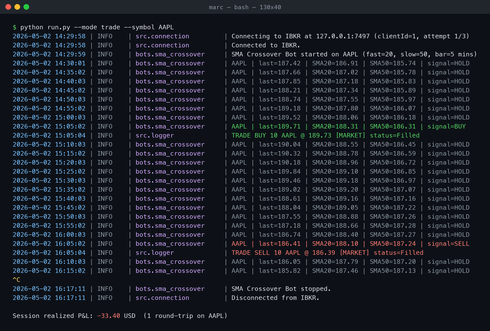
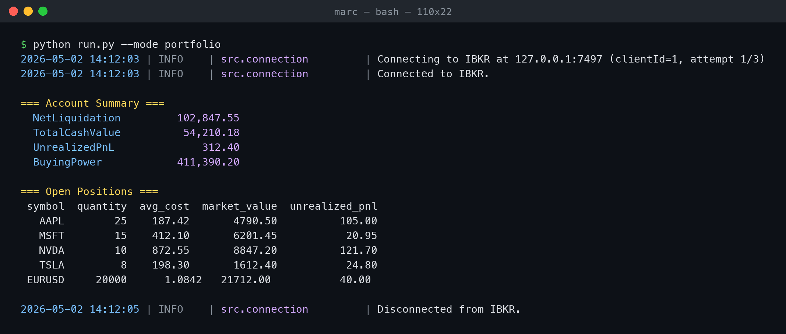

# ibkr-trading-demo


Demo project showcasing Interactive Brokers API integration — connection management, market data, order execution, and a simple trading bot architecture.



## Features

- TWS API connection with auto-reconnect (exponential backoff, context manager)
- Real-time and historical market data via `ib_insync`
- Order execution (Market / Limit / Stop) gated by configurable risk checks
- Portfolio tracking and account-level P&L monitoring
- Pluggable demo bot (SMA crossover) built on top of the core modules
- Trade and event logging to dated CSV files
- Pure CLI — no web UI, no database, single config file

## Prerequisites

- Python 3.10+
- Interactive Brokers **TWS** or **IB Gateway** running locally with API access enabled
- A **Paper Trading** account (the default port `7497` targets paper TWS)

In TWS: `File → Global Configuration → API → Settings`, enable
*Enable ActiveX and Socket Clients* and add `127.0.0.1` to *Trusted IP Addresses*.

## Quick start

```bash
git clone https://github.com/marcgoebel/ibkr-trading-demo.git
cd ibkr-trading-demo
python -m venv .venv && source .venv/bin/activate
pip install -r requirements.txt

# Edit config.yaml — at minimum set the right port for your TWS/Gateway.
python run.py --mode portfolio
```

## Usage

### View account & positions

```bash
python run.py --mode portfolio
```



```
=== Account Summary ===
  NetLiquidation         102,847.55
  TotalCashValue          54,210.18
  UnrealizedPnL              312.40
  BuyingPower            411,390.20

=== Open Positions ===
 symbol  quantity  avg_cost  market_value  unrealized_pnl
   AAPL        25    187.42       4790.50          105.00
   MSFT        15    412.10       6201.45           20.95
```

### Inspect open orders

```bash
python run.py --mode orders
```

### Run the demo trading bot

```bash
python run.py --mode trade --symbol AAPL
```

```
2026-05-02 14:30:00 | INFO    | src.connection         | Connecting to IBKR at 127.0.0.1:7497 (clientId=1, attempt 1/3)
2026-05-02 14:30:00 | INFO    | src.connection         | Connected to IBKR.
2026-05-02 14:30:01 | INFO    | bots.sma_crossover     | SMA Crossover Bot started on AAPL (fast=20, slow=50, bar=5 mins)
2026-05-02 14:30:03 | INFO    | bots.sma_crossover     | AAPL | last=187.42 | SMA20=186.91 | SMA50=185.74 | signal=HOLD
2026-05-02 14:35:04 | INFO    | bots.sma_crossover     | AAPL | last=187.85 | SMA20=187.04 | SMA50=185.81 | signal=BUY
2026-05-02 14:35:05 | INFO    | src.logger             | TRADE BUY 10 AAPL @ 187.86 [MARKET] status=Filled
```

Press `Ctrl+C` to stop — open orders are cancelled and a `BOT_STOP` event is logged.

## Architecture

```
                       ┌──────────────────────┐
                       │   config.yaml        │
                       │   (limits & params)  │
                       └──────────┬───────────┘
                                  │ loaded once
                                  ▼
┌───────────────┐   ┌──────────────────────────┐   ┌────────────────┐
│  IBKR TWS /   │◄─►│      IBKRConnection      │   │  TradeLogger   │
│  IB Gateway   │   │  (auto-reconnect, ctx)   │   │  (CSV + stdlog)│
└───────────────┘   └────────────┬─────────────┘   └────────▲───────┘
                                 │ ib_insync.IB             │
              ┌──────────────────┼─────────────┐            │
              ▼                  ▼             ▼            │
       ┌────────────┐    ┌──────────────┐  ┌────────────┐   │
       │ DataFeed   │    │  Portfolio   │  │ RiskGuard  │   │
       │ (bars,     │    │  (positions, │  │ (4 checks) │   │
       │  ticks)    │    │   summary,   │  └─────┬──────┘   │
       └─────┬──────┘    │   pnl)       │        │          │
             │           └──────┬───────┘        │          │
             │ DataFrame        │ snapshot       │ allow?   │
             ▼                  ▼                ▼          │
        ┌────────────────────────────────────────────┐      │
        │         SMACrossoverBot                    │      │
        │  bars → SMA(fast/slow) → crossover signal  │      │
        └─────────────────────┬──────────────────────┘      │
                              │ BUY / SELL                  │
                              ▼                             │
                    ┌─────────────────────┐                 │
                    │   OrderManager      │  log_trade()    │
                    │   (risk-checked,    │ ───────────────►│
                    │    audited)         │                 │
                    └──────────┬──────────┘                 │
                               │ placeOrder                 │
                               ▼                            │
                       ┌───────────────┐                    │
                       │    IBKR       │  fill / status     │
                       │   (broker)    │ ───────────────────┘
                       └───────────────┘
```

The flow is intentionally one-way per cycle: **DataFeed → Signal → RiskGuard → OrderManager → Broker → TradeLogger**. Adding a new strategy means writing a new `bots/<name>.py` that consumes the same primitives — no changes to the core modules needed.

## Project layout

```
ibkr-trading-demo/
├── README.md
├── requirements.txt
├── config.yaml
├── LICENSE
├── run.py                  # CLI entry point
├── src/
│   ├── connection.py       # IBKR connection + auto-reconnect
│   ├── data_feed.py        # Historical bars, snapshots, live ticks
│   ├── portfolio.py        # Positions, account summary, P&L
│   ├── order_manager.py    # Risk-gated order execution
│   ├── risk_guard.py       # Pre-trade limit checks
│   └── logger.py           # Trade & event logging to CSV
└── bots/
    └── sma_crossover.py    # Demo bot (intentionally simple)
```

## Configuration

All runtime parameters live in `config.yaml`:

| Section       | Key                  | Meaning                                        |
| ------------- | -------------------- | ---------------------------------------------- |
| `connection`  | `host`, `port`, `client_id` | TWS / IB Gateway socket                  |
| `trading`    | `symbol`             | Default symbol when `--symbol` is omitted      |
| `trading`    | `bar_size`, `duration` | Historical bar request window                |
| `trading`    | `sma_fast`, `sma_slow` | Crossover periods                            |
| `risk`        | `max_position_pct`   | Max single-position size as % of NetLiquidation |
| `risk`        | `max_open_positions` | Hard cap on concurrent open positions          |
| `risk`        | `daily_loss_limit`   | Block new trades after this realized loss      |
| `risk`        | `min_buying_power`   | Required buying power floor (USD)              |
| `logging`     | `log_dir`, `level`   | CSV output directory and stdlib log level      |

## Disclaimer

This is a demonstration project. The SMA crossover strategy is intentionally
basic and **not** meant for live trading — it exists to showcase API
integration patterns, risk-gated execution, and bot architecture. Run it
exclusively against a **paper trading** account.

## License

MIT — see [LICENSE](LICENSE).
